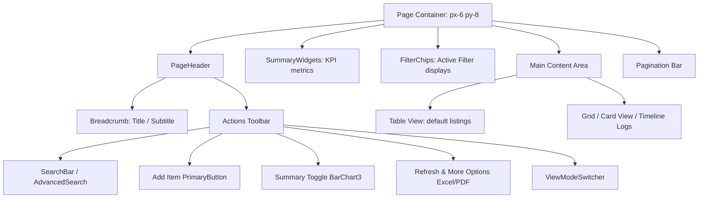

# 🎨 HB Templates: UI/UX & Design System Reference Guide

This document serves as a complete reference and implementation specification for the **"Hb Templates"** module and its core submodules: **"UI Kit"** and **"Sample Page"**. Use this to align, structure, and correct UI/UX designs and component behavior in other projects.

---

## 📌 Section 1: Design Tokens & Foundations

Consistency in colors, typography, spacing, and elevation is what builds a premium, cohesive enterprise application.

### 1. Color Palette & Dynamic Themes
The template uses HSL variable mapping to support multiple accent themes (Natural, Slate, Nord, Midnight, Warm) and clean Dark Mode switches.
*   **Primary Accent (Theme Dependent):**
    *   *Natural/Nord:* Blue-Indigo (e.g., `bg-primary-600` / `#2563eb`)
    *   *Slate/Midnight:* Deep Slate to dark blues
*   **Neutrals:**
    *   *Light Mode:* Pure white background (`#ffffff`), borders/dividers (`bg-neutral-200` or `#e5e7eb`), light gray hover (`bg-neutral-50` or `#f9fafb`).
    *   *Dark Mode:* Neutral-950 (`#0a0a0a`), borders/dividers (`bg-neutral-800` or `#262626`), dark gray hover (`bg-neutral-900/50` or `#171717`).
*   **Semantic Accents:**
    *   *Success:* Green (e.g., `emerald-500` / `bg-success-500`)
    *   *Warning/Pending:* Amber (e.g., `amber-500` / `bg-warning-500`)
    *   *Error/Destructive:* Red (e.g., `rose-500` / `bg-error-500`)
    *   *Info:* Blue (e.g., `blue-500` / `bg-info-500`)

### 2. Spacing & Grid System (4px Scale)
All elements must align to a strict **4px spacing grid**. Never use arbitrary margins or paddings:
*   `space-1` = 4px | `space-2` = 8px | `space-3` = 12px
*   `space-4` = 16px (standard card padding / gap)
*   `space-6` = 24px (standard header gap / margin)
*   `space-8` = 32px (large section spacing)

### 3. Typography Hierarchy
Typography is managed systematically using global CSS values (overriding browser defaults, using **Inter** or **Outfit**):
*   `h1` (Page Title): `32px` | Semibold/Bold | Line height: `40px` | Tracking: `-0.02em`
*   `h2` (Section Heading): `24px` | Semibold | Line height: `32px` | Tracking: `-0.01em`
*   `h3` (Subheading): `18px` | Semibold | Line height: `26px`
*   `h4` (Small Subheading): `16px` | Semibold | Line height: `24px`
*   `p` (Body text): `14px` | Regular | Line height: `22px`
*   `.text-lead` (Featured text): `16px` | Regular | Line height: `24px`
*   `.text-small` (Helper / secondary text): `12px` | Regular | Line height: `18px`
*   `.text-muted` (De-emphasized): `14px` | Gray (`neutral-500` light / `neutral-400` dark)

### 4. Elevation (Shadows & Borders)
Every elevated element must carry a subtle border alongside the shadow to define the boundary clearly:
*   **Level 1 (Card Default):** `shadow-sm` + `border-neutral-200` (Light) / `border-neutral-800` (Dark).
*   **Level 2 (Popups/Dropdowns):** `shadow-md` + `border` + `rounded-lg` (8px-12px radius).
*   **Level 3 (Modals/Overlays):** `shadow-xl` + `border` + `rounded-xl` (12px-16px radius).

---

## 🎨 Section 2: "UI Kit" Submodule Specification

The UI Kit includes foundational components that are reused universally to guarantee a clean interaction system.

### 1. Button Components
All buttons have a standardized height of **40px** (`h-10`) to match other header/filter elements.
*   **Primary Button:**
    *   *Styling:* `h-10 bg-primary-600 hover:bg-primary-700 text-white font-medium rounded-lg px-4 py-2 flex items-center gap-2`
    *   *Icons:* Size `16x16px` (`w-4 h-4`)
*   **Secondary Button:**
    *   *Styling:* `h-10 bg-white dark:bg-neutral-950 border border-neutral-300 dark:border-neutral-700 text-neutral-700 dark:text-neutral-300 hover:bg-neutral-50 dark:hover:bg-neutral-900/50 rounded-lg px-4 py-2`
*   **Icon Button:**
    *   *Styling:* `w-10 h-10 flex items-center justify-center bg-white dark:bg-neutral-950 border border-neutral-200 dark:border-neutral-800 rounded-lg hover:border-primary-300 dark:hover:border-primary-700 text-neutral-600 dark:text-neutral-400 transition-colors`
    *   *Icons:* Size `20x20px` (`w-5 h-5`)

### 2. Form Control Elements
*   **Inputs & Textareas:**
    *   *Focus State:* Transition ring on focus utilizing the **primary accent** (e.g. `focus:ring-2 focus:ring-primary-500/20 focus:border-primary-500`). Avoid default black focus outlines.
    *   *Border style:* `border-neutral-200` (Light) / `border-neutral-800` (Dark).
*   **Select Dropdown Panel:**
    *   *Height:* Trigger is `h-10` (40px).
    *   *Dropdown overlay:* Shadow `shadow-md`, `rounded-lg` (8px), and high z-index (`z-[100]`).
    *   *Item Rounded Corner Rules:* To maintain a sleek capsule appearance:
        *   **First Item:** Top corners rounded only (`rounded-t-lg`).
        *   **Last Item:** Bottom corners rounded only (`rounded-b-lg`).
        *   **Middle Items:** Square corners (`rounded-none`).
        *   *Active/Hover State:* Background `bg-primary-50` (Light) / `bg-primary-950/40` (Dark), with checkmark icon aligned right.
*   **Checkbox & Radio Styling:**
    *   Avoid browser default accent colors.
    *   *Selected state Checkbox:* White checkmark centered on primary accent background color.
    *   *Selected state Radio:* Double ring checkmark (white inner dot, primary color border).
*   **Switches:**
    *   Track transitions smoothly from gray (`bg-neutral-200`) when off to primary accent (`bg-primary-600`) when active.

---

## 📋 Section 3: Generic Listing Page Architecture

All data listing pages (such as Users, Events, Roles, Masters) follow a structured blueprint inspired by the **Sample Page** design.



### 1. Page Header Toolbar Components
*   **SearchBar:** Starts as a 40x40px icon button. When clicked, it expands smoothly to a search bar (minimum `320px` width) with an inner `Search` icon on the left, an input, and a clear `X` icon on the right.
*   **PageHeader Layout:** Aligns the title and breadcrumbs to the left. The children actions are flexed to the right with a standardized `gap-2` to align inputs, buttons, and switches horizontally.
*   **Advanced Search Panel:** Slide-out or dropdown menu with inputs to specify filter constraints. Includes a clear indicator chip system for active filters.

### 2. View Switching & Column Selection Rule
*   **ViewModeSwitcher:** Swaps display between 'table' and card layouts ('grid' or 'list'). 
*   **Timeline View Restriction:** The timeline view is **strictly isolated to the Logs module only** (`LogsManagement.tsx`) and is not enabled in any other listing screen to prevent clutter.
*   **Column Selection Logic:** The **Column Selection icon and visibility panel** must **ONLY** be displayed when `viewMode === 'table'`. Toggling to any other mode (Grid, Card, List, Timeline) must auto-close the column selection overlay and hide the control button.

### 3. Excel & PDF Export Protocol
Standardize the "Export" button into a "More Options" dropdown (`MoreVertical` menu icon) containing:
1.  **Export as Excel** (icon: `FileSpreadsheet`)
2.  **Export as PDF** (icon: `FileText`)

#### Exporter Requirements:
Both export commands must fetch the current states and generate downloads locally:
*   Respect **active search queries** (exclude non-matching items).
*   Respect **active advanced filters** (exclude filtered items).
*   Respect **multi-row selections** (if checkboxes are checked, only export selected rows).
*   Respect **column visibility settings** (only output columns that are currently marked visible).

---

## 👤 Section 4: "Sample Page" UI/UX Pattern (Employee Management)

The Sample Page provides a production-grade blueprint for general database management. Key mechanics to match:

### 1. Dynamic Metric Summary Widgets Toggle
*   The summary panel is toggled with the `BarChart3` icon.
*   The summary widget shows four metric cards. For example, in Employee Management:
    *   **Total:** Overall database item count.
    *   **Active:** Active count.
    *   **On Leave / Warning:** Secondary status.
    *   **Inactive / Failed:** Negative status.
*   *State code implementation:*
    ```tsx
    const [showSummary, setShowSummary] = useState(true);
    // ...
    <IconButton icon={BarChart3} onClick={() => setShowSummary(!showSummary)} title="Summary" />
    // ...
    {showSummary && <SummaryWidgets widgets={[...]} />}
    ```

### 2. Standard Multiselect and Bulk Actions Bar
When items are selected via checking list checkboxes:
*   Show a checkboxes column on the extreme left of the Table.
*   When one or more items are selected, slide up a floating **Bulk Action Toolbar** at the bottom center of the viewport.
*   *Bulk Actions Toolbar Specs:*
    *   **Background:** HSL tailored dark-gray (`bg-neutral-900`) or glassmorphic blur.
    *   **Content:** Text indicating selection count (e.g., "3 selected") and action buttons (e.g., Bulk Delete, Change Status).
    *   **Button to Clear:** Standard secondary close or clear selection button.

---

## 🛠️ Implementation Checklist for New Project

Use this checklist when building or auditing listings in another project:

*   [ ] **Design System:** Verify standard typography headings (`h1` to `h4`) and standard 4px paddings are used.
*   [ ] **Primary/Secondary Buttons:** Standardized to exactly 40px height with 16px icons.
*   [ ] **Focus State:** Inputs use a subtle primary accent ring instead of browser default black.
*   [ ] **Select Panel:** Dropdown items follow the rounded corners spec (first top rounded, last bottom rounded, middle square) and carry `z-[100]`.
*   [ ] **Summary Widgets:** Includes the togglable summary widget layout using the `BarChart3` button.
*   [ ] **Column Select:** Restricted strictly to table view mode. Closed and hidden in list/grid/timeline modes.
*   [ ] **Export dropdown:** Submenu with Excel & PDF selectors that dynamically read search queries, active filter matrices, select sets, and visible columns.
*   [ ] **Timeline View:** Present ONLY on the Logs screen, excluded from other listings.
